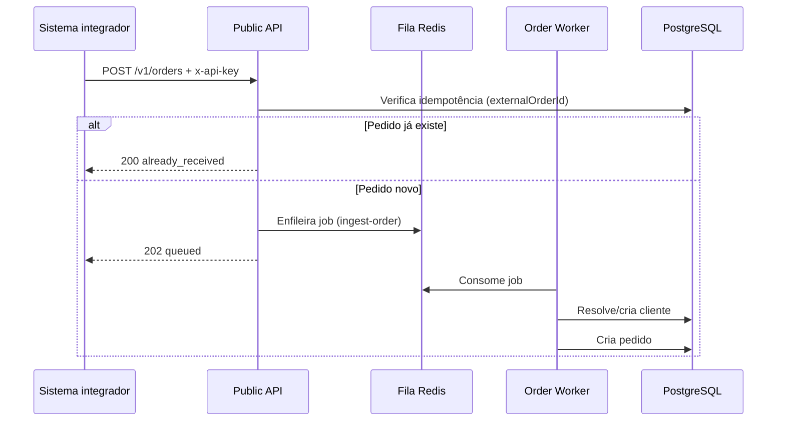

# Public API — Documentação Técnica

API pública para integração de sistemas externos (PDVs, marketplaces, ERPs) com a plataforma **FoodCRM** ou **LavPerform**, conforme configuração de whitelabel.

> **Swagger interativo:** `{BASE_URL}/api`  
> **Versão atual:** `1.0`

---

## Sumário

1. [Visão geral](#visão-geral)
2. [Ambientes e URLs](#ambientes-e-urls)
3. [Autenticação](#autenticação)
4. [Arquitetura de processamento](#arquitetura-de-processamento)
5. [Endpoints](#endpoints)
6. [Referência do payload — Ingestão de pedidos](#referência-do-payload--ingestão-de-pedidos)
7. [Respostas de sucesso](#respostas-de-sucesso)
8. [Cenários de erro](#cenários-de-erro)
9. [Exemplos de requisição](#exemplos-de-requisição)
10. [Regras de negócio](#regras-de-negócio)
11. [Obtenção e gestão de API keys](#obtenção-e-gestão-de-api-keys)
12. [Variáveis de ambiente](#variáveis-de-ambiente)

---

## Visão geral

A Public API é um serviço NestJS **independente** da API principal. Ela expõe endpoints REST autenticados por **API key** e processa pedidos de forma **assíncrona** via fila Redis (Bull).

| Característica | Detalhe |
|---|---|
| Protocolo | HTTPS (recomendado em produção) |
| Formato | JSON (`Content-Type: application/json`) |
| Autenticação | Header `x-api-key` |
| Escopo | Pedidos vinculados à **empresa** da API key |
| Idempotência | Por `externalOrderId` + `companyId` |

---

## Ambientes e URLs

| Ambiente | Porta padrão | Variável |
|---|---|---|
| Local | `3003` | `PUBLIC_API_PORT` |
| Produção | `3003` | `PUBLIC_API_PORT` |

**Base URL de exemplo (local):**

```
http://localhost:3003
```

**Documentação Swagger:**

```
GET {BASE_URL}/api
```

O título exibido no Swagger depende da variável `WHITELABEL`:

| `WHITELABEL` | Nome exibido |
|---|---|
| `foodcrm` | FoodCRM Api |
| Outro valor / ausente | LavPerform |

---

## Autenticação

Todas as rotas protegidas exigem o header:

```http
x-api-key: fcrm_{prefix}_{secret}
```

### Formato da API key

```
fcrm_{prefix}_{secret}
```

| Parte | Descrição | Exemplo |
|---|---|---|
| `fcrm` | Prefixo fixo do produto | `fcrm` |
| `{prefix}` | 8 caracteres hex (identificador público) | `abcd1234` |
| `{secret}` | Segredo aleatório (base64url, 24 bytes) | `xK9mP2nQ7vR4wL8jH3fT6yU1` |

**Exemplo completo:**

```
fcrm_abcd1234_xK9mP2nQ7vR4wL8jH3fT6yU1
```

> A chave completa é exibida **apenas uma vez** no momento da criação ou rotação, via Admin API ou painel administrativo.

### Validações realizadas

1. Header `x-api-key` presente
2. Formato `fcrm_{prefix}_{secret}` válido
3. Hash SHA-256 da chave confere com o registro no banco
4. Status da key: `ACTIVE` (não revogada nem expirada)
5. Empresa vinculada não está excluída (`deletedAt` nulo)

Após autenticação bem-sucedida, o campo `lastUsedAt` da key é atualizado.

---

## Arquitetura de processamento



| Etapa | Comportamento |
|---|---|
| **Síncrona (HTTP)** | Validação de payload, autenticação, checagem de idempotência, enfileiramento |
| **Assíncrona (Worker)** | Resolução de cliente (telefone/CPF), criação do pedido e itens/pagamentos |

**Configuração da fila:**

| Parâmetro | Valor |
|---|---|
| Nome da fila | `public-api-order-ingestion` |
| Job | `ingest-order` |
| Tentativas | 5 |
| Backoff | Exponencial, 3 s |
| Job ID | `{companyId}:{externalOrderId}` |

> O worker roda em processo separado (`public-api-order-worker`). Sem o worker ativo, pedidos ficam enfileirados mas não são persistidos.

---

## Endpoints

### `POST /v1/orders`

Inclui um novo pedido para a loja vinculada à API key.

| Item | Valor |
|---|---|
| Método | `POST` |
| Path | `/v1/orders` |
| Auth | `x-api-key` (obrigatório) |
| Content-Type | `application/json` |

**Descrição:** Recebe o payload do pedido, valida os campos e enfileira para processamento assíncrono. Retorna imediatamente — a persistência ocorre no worker.

---

## Referência do payload — Ingestão de pedidos

### Campos do pedido (`IngestOrderDto`)

#### Obrigatórios

| Campo | Tipo | Descrição |
|---|---|---|
| `externalOrderId` | `string` | ID único do pedido no sistema integrador. Chave de idempotência. |
| `displayId` | `number` | Número exibido do pedido (comanda). |
| `status` | `string` | Status do pedido (ver enum abaixo). |
| `orderType` | `string` | Tipo do pedido (ver enum abaixo). |
| `orderTiming` | `string` | `instant` ou `scheduled`. |
| `deliveryFee` | `number` | Taxa de entrega. |
| `serviceFee` | `number` | Taxa de serviço. |
| `additionalFee` | `number` | Taxas adicionais. |
| `total` | `number` | Valor total do pedido. |
| `customer` | `object` | Dados do cliente (ver abaixo). |
| `createdAt` | `string` (ISO 8601) | Data/hora de criação na origem. |
| `updatedAt` | `string` (ISO 8601) | Data/hora da última atualização na origem. |

#### Opcionais

| Campo | Tipo | Descrição |
|---|---|---|
| `salesChannel` | `string` | Canal de venda. Se omitido, usa slug do partner ou `"public_api"`. |
| `partnerId` | `string` (UUID) | ID do partner de origem (ex.: iFood, Anota AI). |
| `customerOrigin` | `string` | Origem do cliente. Default: valor de `salesChannel`. |
| `merchantId` | `number` | ID do merchant na origem. Default: `0`. |
| `tableNumber` | `string` | Número da mesa (ex.: `"Mesa 12"`). |
| `estimatedTime` | `number` | Tempo estimado em minutos. |
| `cancellationReason` | `string` | Motivo do cancelamento (quando `status = cancelled`). |
| `fiscalDocument` | `string` | Documento fiscal (NFC-e, etc.). |
| `observation` | `string` | Observações gerais do pedido. |
| `deliveryAddress` | `object` | Endereço de entrega. |
| `schedule` | `object` | Agendamento (pedidos `scheduled`). |
| `items` | `array` | Itens do pedido. |
| `payments` | `array` | Pagamentos. |
| `discounts` | `array` | Descontos aplicados. |

#### Enums — `status`

Valores aceitos:

```
closed | cancelled | pending | confirmed | preparing | ready | delivered
```

#### Enums — `orderType`

Valores aceitos:

```
delivery | takeout | dine_in | indoor | pickup
```

#### Enums — `orderTiming`

```
instant | scheduled
```

---

### Cliente (`customer`)

| Campo | Tipo | Obrigatório | Descrição |
|---|---|---|---|
| `name` | `string` | Sim | Nome completo. |
| `phone` | `string` | Condicional* | Telefone com ou sem máscara. |
| `cpf` | `string` | Condicional* | CPF (somente dígitos). |
| `email` | `string` | Não | E-mail. |
| `birthDate` | `string` (ISO date) | Não | Data de nascimento (`YYYY-MM-DD`). |
| `gender` | `string` | Não | `M`, `F` ou `Outro`. |
| `address` | `object` | Não | Endereço do cliente. |

> \* **Regra:** informe **pelo menos um** entre `phone` ou `cpf`.

**Normalização de telefone:** números são normalizados para o formato `55{DDD}{9}{número}`. Exemplos:

| Enviado | Armazenado |
|---|---|
| `(41) 99726-9435` | `5541997269435` |
| `41997269435` | `5541997269435` |
| `5541997269435` | `5541997269435` |

**Normalização de CPF:** caracteres não numéricos são removidos.

---

### Endereço de entrega (`deliveryAddress`)

| Campo | Tipo |
|---|---|
| `street` | `string` |
| `number` | `string` |
| `complement` | `string` |
| `neighborhood` | `string` |
| `city` | `string` |
| `state` | `string` |
| `zipCode` | `string` |
| `reference` | `string` |

Todos os campos são opcionais.

---

### Agendamento (`schedule`)

| Campo | Tipo | Obrigatório |
|---|---|---|
| `deliveryDateRaw` | `string` | Sim — ex.: `"2026-06-18"` |
| `deliveryTimeRaw` | `string` | Sim — ex.: `"19:30"` |
| `deliveryAt` | `string` (ISO 8601) | Não |

---

### Item do pedido (`items[]`)

| Campo | Tipo | Obrigatório |
|---|---|---|
| `itemId` | `number` | Sim |
| `name` | `string` | Sim |
| `quantity` | `number` | Sim |
| `unitPrice` | `number` | Sim |
| `totalPrice` | `number` | Sim |
| `kind` | `string` | Sim — `item`, `combo` ou `service` |
| `status` | `string` | Sim — `confirmed` ou `cancelled` |
| `externalCode` | `string` | Não |
| `observation` | `string` | Não |
| `items` | `array` | Não — sub-itens (combos) |
| `options` | `array` | Não — adicionais/opções |

#### Opção de item (`options[]`)

| Campo | Tipo | Obrigatório |
|---|---|---|
| `optionId` | `number` | Sim |
| `name` | `string` | Sim |
| `quantity` | `number` | Sim |
| `unitPrice` | `number` | Sim |
| `optionGroupId` | `number` | Sim |
| `optionGroupName` | `string` | Sim |
| `externalCode` | `string` | Não |

---

### Pagamento (`payments[]`)

| Campo | Tipo | Obrigatório |
|---|---|---|
| `total` | `number` | Sim |
| `paymentType` | `string` | Sim — ex.: `online`, `offline` |
| `status` | `string` | Sim — `paid`, `pending`, `refunded` |
| `paymentMethod` | `string` | Sim — ex.: `credit_card`, `pix`, `cash` |
| `paymentFee` | `number` | Sim |
| `changeFor` | `number` | Não |
| `cardNumber` | `string` | Não — ex.: `****1234` |
| `cardBrand` | `string` | Não — ex.: `visa` |
| `observation` | `string` | Não |

---

### Desconto (`discounts[]`)

| Campo | Tipo | Obrigatório |
|---|---|---|
| `type` | `string` | Sim — ex.: `coupon` |
| `value` | `number` | Sim |
| `description` | `string` | Não |

---

## Respostas de sucesso

### `202 Accepted` — Pedido enfileirado

Retornado quando o pedido é **novo** e foi enfileirado com sucesso.

```json
{
  "status": "queued",
  "jobId": "a1b2c3d4-e5f6-7890-abcd-ef1234567890:order-ext-12345",
  "externalOrderId": "order-ext-12345"
}
```

| Campo | Descrição |
|---|---|
| `status` | Sempre `"queued"`. |
| `jobId` | ID do job na fila (`{companyId}:{externalOrderId}`). |
| `externalOrderId` | Eco do identificador enviado. |

---

### `200 OK` — Pedido já recebido (idempotência)

Retornado quando um pedido com o mesmo `externalOrderId` **já existe** para a empresa da API key.

```json
{
  "status": "already_received",
  "externalOrderId": "order-ext-12345",
  "orderId": "550e8400-e29b-41d4-a716-446655440000"
}
```

| Campo | Descrição |
|---|---|
| `status` | Sempre `"already_received"`. |
| `externalOrderId` | Eco do identificador enviado. |
| `orderId` | UUID do pedido já persistido (quando disponível). |

> Reenviar o mesmo pedido é seguro: não cria duplicatas nem reprocessa o job.

---

## Cenários de erro

Todas as respostas de erro seguem o formato padrão NestJS:

```json
{
  "statusCode": 400,
  "message": "Descrição do erro ou array de mensagens",
  "error": "Bad Request"
}
```

---

### `401 Unauthorized` — Problemas de autenticação

| Cenário | `message` |
|---|---|
| Header `x-api-key` ausente | `"API key ausente"` |
| Formato inválido (não começa com `fcrm_`) | `"API key inválida"` |
| Prefix não encontrado no banco | `"API key inválida"` |
| Hash não confere | `"API key inválida"` |
| Key revogada | `"API key revogada"` |
| Key expirada | `"API key expirada"` |
| Empresa excluída/inativa | `"Empresa inativa"` |

**Exemplo — sem API key:**

```http
POST /v1/orders HTTP/1.1
Content-Type: application/json

{ "externalOrderId": "..." }
```

```json
{
  "statusCode": 401,
  "message": "API key ausente",
  "error": "Unauthorized"
}
```

**Exemplo — key revogada:**

```json
{
  "statusCode": 401,
  "message": "API key revogada",
  "error": "Unauthorized"
}
```

---

### `400 Bad Request` — Payload inválido

Retornado quando a validação do body falha ou regras de negócio são violadas na camada HTTP.

#### Cliente sem telefone nem CPF

```json
{
  "statusCode": 400,
  "message": "Informe pelo menos um entre phone ou cpf do cliente",
  "error": "Bad Request"
}
```

#### Partner não encontrado

Enviado quando `partnerId` é informado mas não existe no banco.

```json
{
  "statusCode": 400,
  "message": "Partner não encontrado",
  "error": "Bad Request"
}
```

#### Campos obrigatórios ausentes ou tipos inválidos

Quando múltiplas validações falham, `message` é um **array**:

```json
{
  "statusCode": 400,
  "message": [
    "externalOrderId must be a string",
    "displayId must be a number conforming to the specified constraints",
    "status must be one of the following values: closed, cancelled, pending, confirmed, preparing, ready, delivered",
    "customer must be an object",
    "createdAt must be a valid ISO 8601 date string"
  ],
  "error": "Bad Request"
}
```

#### Enum inválido — `status`

```json
{
  "statusCode": 400,
  "message": [
    "status must be one of the following values: closed, cancelled, pending, confirmed, preparing, ready, delivered"
  ],
  "error": "Bad Request"
}
```

#### `partnerId` com formato inválido (não UUID)

```json
{
  "statusCode": 400,
  "message": [
    "partnerId must be a UUID"
  ],
  "error": "Bad Request"
}
```

---

### `503 Service Unavailable` — Fila indisponível

Retornado quando o Redis/fila não está acessível e o pedido não pôde ser enfileirado.

```json
{
  "statusCode": 503,
  "message": "Fila de ingestão indisponível no momento",
  "error": "Service Unavailable"
}
```

**Ação recomendada:** implementar retry com backoff exponencial no integrador.

---

### Resumo de códigos HTTP

| Código | Situação | Ação do integrador |
|---|---|---|
| `202` | Pedido novo enfileirado | OK — aguardar processamento assíncrono |
| `200` | Pedido duplicado (idempotência) | OK — tratar como sucesso |
| `400` | Payload ou partner inválido | Corrigir dados e reenviar |
| `401` | Problema de autenticação | Verificar/rotacionar API key |
| `503` | Fila indisponível | Retry com backoff |

---

## Exemplos de requisição

### Pedido completo (delivery)

```bash
curl -X POST "http://localhost:3003/v1/orders" \
  -H "Content-Type: application/json" \
  -H "x-api-key: fcrm_abcd1234_SEU_SECRET_AQUI" \
  -d '{
    "externalOrderId": "order-ext-12345",
    "displayId": 12345,
    "status": "closed",
    "orderType": "delivery",
    "orderTiming": "instant",
    "salesChannel": "ifood",
    "customerOrigin": "ifood",
    "merchantId": 0,
    "deliveryFee": 5,
    "serviceFee": 0,
    "additionalFee": 0,
    "total": 55.9,
    "customer": {
      "name": "João Silva",
      "phone": "41997269435",
      "cpf": "12345678900",
      "email": "joao@exemplo.com"
    },
    "deliveryAddress": {
      "street": "Rua das Flores",
      "number": "123",
      "neighborhood": "Centro",
      "city": "Curitiba",
      "state": "PR",
      "zipCode": "80010-000"
    },
    "items": [
      {
        "itemId": 100,
        "name": "X-Burger",
        "quantity": 2,
        "unitPrice": 25,
        "totalPrice": 50,
        "kind": "item",
        "status": "confirmed"
      }
    ],
    "payments": [
      {
        "total": 55.9,
        "paymentType": "online",
        "status": "paid",
        "paymentMethod": "credit_card",
        "paymentFee": 0
      }
    ],
    "createdAt": "2026-06-18T18:30:00.000Z",
    "updatedAt": "2026-06-18T18:45:00.000Z"
  }'
```

**Resposta esperada:**

```json
{
  "status": "queued",
  "jobId": "company-uuid:order-ext-12345",
  "externalOrderId": "order-ext-12345"
}
```

---

### Pedido sem CPF (somente telefone)

```json
{
  "externalOrderId": "order-ext-no-cpf",
  "displayId": 12346,
  "status": "closed",
  "orderType": "delivery",
  "orderTiming": "instant",
  "deliveryFee": 5,
  "serviceFee": 0,
  "additionalFee": 0,
  "total": 55.9,
  "customer": {
    "name": "Maria Souza",
    "phone": "41988887777"
  },
  "createdAt": "2026-06-18T18:30:00.000Z",
  "updatedAt": "2026-06-18T18:45:00.000Z"
}
```

---

### Pedido sem telefone (somente CPF)

```json
{
  "externalOrderId": "order-ext-no-phone",
  "displayId": 12347,
  "status": "closed",
  "orderType": "takeout",
  "orderTiming": "instant",
  "deliveryFee": 0,
  "serviceFee": 0,
  "additionalFee": 0,
  "total": 45.0,
  "customer": {
    "name": "Carlos Lima",
    "cpf": "98765432100"
  },
  "createdAt": "2026-06-18T18:30:00.000Z",
  "updatedAt": "2026-06-18T18:45:00.000Z"
}
```

---

### Pedido cancelado

```json
{
  "externalOrderId": "order-ext-cancelled",
  "displayId": 12348,
  "status": "cancelled",
  "orderType": "delivery",
  "orderTiming": "instant",
  "cancellationReason": "Cliente desistiu",
  "deliveryFee": 5,
  "serviceFee": 0,
  "additionalFee": 0,
  "total": 55.9,
  "customer": {
    "name": "João Silva",
    "phone": "41997269435"
  },
  "createdAt": "2026-06-18T18:30:00.000Z",
  "updatedAt": "2026-06-18T19:00:00.000Z"
}
```

---

### Pedido em nome de um partner

Quando a integração envia pedidos de um marketplace/parceiro, informe `partnerId`:

```json
{
  "externalOrderId": "order-ext-partner",
  "displayId": 12349,
  "status": "closed",
  "orderType": "delivery",
  "orderTiming": "instant",
  "partnerId": "123e4567-e89b-12d3-a456-426614174000",
  "salesChannel": "ifood",
  "deliveryFee": 5,
  "serviceFee": 0,
  "additionalFee": 0,
  "total": 55.9,
  "customer": {
    "name": "João Silva",
    "phone": "41997269435"
  },
  "createdAt": "2026-06-18T18:30:00.000Z",
  "updatedAt": "2026-06-18T18:45:00.000Z"
}
```

---

### Pedido mínimo (campos obrigatórios apenas)

```json
{
  "externalOrderId": "order-minimal-001",
  "displayId": 1,
  "status": "closed",
  "orderType": "delivery",
  "orderTiming": "instant",
  "deliveryFee": 0,
  "serviceFee": 0,
  "additionalFee": 0,
  "total": 29.9,
  "customer": {
    "name": "Cliente Teste",
    "phone": "41999999999"
  },
  "createdAt": "2026-06-18T18:30:00.000Z",
  "updatedAt": "2026-06-18T18:30:00.000Z"
}
```

---

## Regras de negócio

### Idempotência

- A chave de idempotência é `{companyId}:{externalOrderId}`.
- Pedidos duplicados retornam `200` com `status: "already_received"`.
- O job na fila também usa o mesmo ID, evitando processamento duplicado concorrente.

### Resolução de cliente (worker)

Ordem de busca na base da empresa:

1. Por **telefone** normalizado (se informado)
2. Por **CPF** normalizado (se informado e cliente não encontrado por telefone)

Se encontrado: dados são **atualizados** com informações do payload (merge).  
Se não encontrado: **novo cliente** é criado.

### Canal de venda (`salesChannel`)

Prioridade de resolução:

1. Valor explícito em `salesChannel`
2. `partnerSlug` do partner (quando `partnerId` informado)
3. Nome do partner normalizado (`lowercase`, espaços → `_`)
4. Fallback: `"public_api"`

### Processamento assíncrono e falhas

| Situação | Comportamento |
|---|---|
| Worker offline | HTTP retorna `202`, job aguarda na fila |
| Falha transient no worker | Até 5 tentativas com backoff exponencial |
| Pedido duplicado no worker | Ignorado silenciosamente (`skipped: true`) |
| Erro não recuperável no worker | Job permanece na fila (`removeOnFail: false`) |

---

## Obtenção e gestão de API keys

As API keys são gerenciadas via **Admin API** (autenticação JWT de administrador) ou pelo **painel admin** da empresa.

| Operação | Admin API |
|---|---|
| Listar keys | `GET /admin/companies/:companyId/api-keys` |
| Obter key ativa | `GET /admin/companies/:companyId/api-keys/active` |
| Criar key | `POST /admin/companies/:companyId/api-keys` |
| Rotacionar key | `POST /admin/companies/:companyId/api-keys/rotate` |
| Revogar key | `PATCH /admin/companies/:companyId/api-keys/:id/revoke` |
| Excluir key | `DELETE /admin/companies/:companyId/api-keys/:id` |

> Cada API key está vinculada a **uma empresa**. Pedidos enviados com essa key são sempre associados a essa empresa.

---

## Variáveis de ambiente

| Variável | Descrição | Default |
|---|---|---|
| `PUBLIC_API_PORT` | Porta HTTP da Public API | `3003` |
| `WHITELABEL` | Marca exibida no Swagger (`foodcrm` → FoodCRM Api) | — |
| `DATABASE_URL` | Conexão PostgreSQL | — |
| `REDIS_HOST` | Host Redis (fila Bull) | — |
| `REDIS_PORT` | Porta Redis | — |
| `JWT_SECRET` | Segredo JWT (fallback para criptografia de keys) | — |
| `PUBLIC_API_KEY_ENCRYPTION_SECRET` | Segredo para criptografar secrets das keys no admin | Usa `JWT_SECRET` |
| `BULL_BOARD_PASSWORD` | Senha do Bull Board em `/queues` | `admin` |
| `APP_RUNTIME` | Runtime da aplicação | `public-api` |

### Comandos úteis

```bash
# Desenvolvimento (API HTTP)
npm run start:public-api:dev

# Produção (API HTTP)
npm run start:public-api:prod

# Worker de ingestão (processo separado)
# Ver public-api-order-worker module / worker-runtime.config
```

---

## Monitoramento

| Recurso | URL | Auth |
|---|---|---|
| Swagger | `/api` | Nenhuma |
| Bull Board (filas) | `/queues` | Basic auth (`admin` / `BULL_BOARD_PASSWORD`) |

---

**Última atualização:** 2026-06-23
