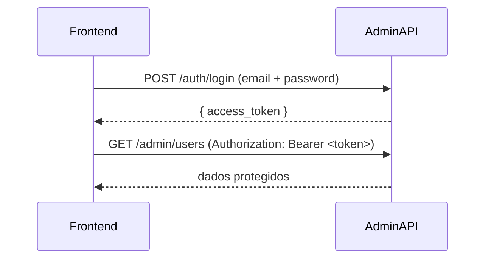

# Admin Auth — Guia de Implementação

## Visão geral

O módulo de autenticação expõe o endpoint de login do painel administrativo. Ele valida as credenciais de um `AdminUser` registrado no banco, verifica se o usuário está ativo (`isActive = true`) e retorna um JWT com duração configurável.

Todos os outros endpoints da API admin exigem o token obtido aqui no header `Authorization: Bearer <token>`.

## Variáveis de ambiente relevantes

| Variável | Descrição | Exemplo |
|---|---|---|
| `ADMIN_PORT` | Porta da API admin | `3001` |
| `ADMIN_JWT_SECRET` | Chave de assinatura do JWT | `minha-chave-secreta` |
| `ADMIN_JWT_EXPIRES_IN` | Validade do token em dias | `1` (padrão: 1 dia) |

**Base URL:** `http://localhost:{{ADMIN_PORT}}`

Swagger interativo disponível em: `{{BASE_URL}}/api`

## Fluxo de autenticação



---

## Endpoints

### POST /auth/login

Autentica um administrador e retorna um JWT de acesso.

**Não requer autenticação.**

#### Body

```json
{
  "email": "admin@foodcrm.com",
  "password": "senha123"
}
```

| Campo | Tipo | Obrigatório | Descrição |
|---|---|---|---|
| `email` | string (email) | Sim | Email cadastrado do administrador |
| `password` | string | Sim | Senha do administrador |

#### Exemplo curl

```bash
curl -X POST "{{BASE_URL}}/auth/login" \
  -H "Content-Type: application/json" \
  -d '{
    "email": "admin@foodcrm.com",
    "password": "senha123"
  }'
```

#### Resposta de sucesso — `200 OK`

```json
{
  "access_token": "eyJhbGciOiJIUzI1NiIsInR5cCI6IkpXVCJ9.eyJhZG1pblVzZXJJZCI6ImFiYzEyMyIsImFkbWluVXNlck5hbWUiOiJBZG1pbiIsImFkbWluVXNlckVtYWlsIjoiYWRtaW5AZm9vZGNybS5jb20iLCJyb2xlIjoiU1VQRVJfQURNSU4iLCJpYXQiOjE3MTYwMDAwMDAsImV4cCI6MTcxNjA4NjQwMH0.signature"
}
```

O payload decodificado do JWT contém:

```json
{
  "adminUserId": "uuid-do-admin",
  "adminUserName": "Nome do Admin",
  "adminUserEmail": "admin@foodcrm.com",
  "role": "SUPER_ADMIN",
  "iat": 1716000000,
  "exp": 1716086400
}
```

#### Respostas de erro

**`400 Bad Request` — Validação de campos**

Ocorre quando `email` está em formato inválido ou algum campo obrigatório está ausente.

```json
{
  "statusCode": 400,
  "message": ["Email inválido", "Senha é obrigatória"],
  "error": "Bad Request"
}
```

**`401 Unauthorized` — Credenciais inválidas ou admin inativo**

Ocorre quando o email não existe no banco, a senha está errada ou o campo `isActive` do administrador é `false`.

```json
{
  "statusCode": 401,
  "message": "Administrador ou senha incorretos.",
  "error": "Unauthorized"
}
```

---

## Como usar o token nas demais requests

Após o login, armazene o `access_token` e inclua em todas as requisições protegidas:

```bash
curl -X GET "{{BASE_URL}}/admin/users" \
  -H "Authorization: Bearer {{TOKEN}}"
```

O token expira conforme `ADMIN_JWT_EXPIRES_IN`. Quando expirado, a API retorna `401` e o frontend deve redirecionar para o login.
