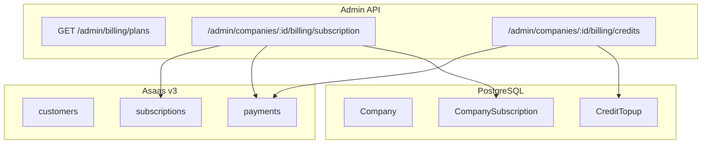
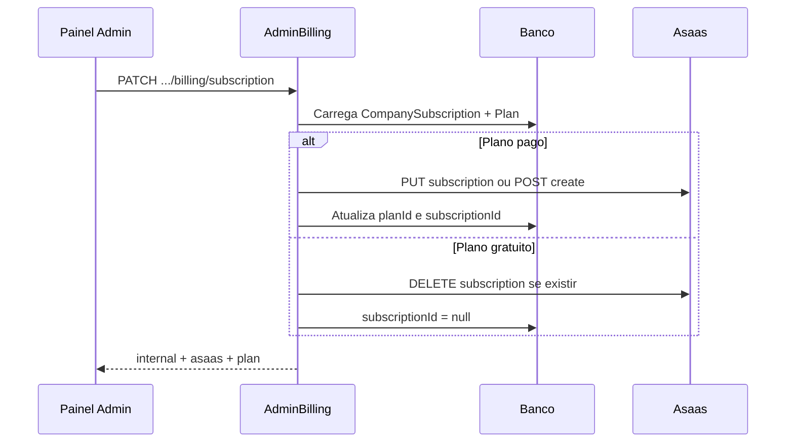

# Admin Billing — Guia de Implementação

## Visão geral

O módulo de billing admin permite gerenciar **assinaturas de plano** e **recargas de créditos** das empresas diretamente via API Asaas: consultar assinatura e cobranças, trocar plano/valores, suspender assinatura, dar baixa em faturas, criar cobranças avulsas, estornar e sincronizar recargas.

**Todos os endpoints exigem autenticação admin.** Obtenha o token em `POST /auth/login` e inclua em cada request:

```
Authorization: Bearer {{TOKEN}}
```

**Base URL:** `http://localhost:{{ADMIN_PORT}}`

**Prefixos:**

| Escopo | Prefixo |
|---|---|
| Planos e catálogo global de créditos | `/admin/billing` |
| Billing por empresa | `/admin/companies/:companyId/billing` |

**Variáveis de ambiente (API):**

| Variável | Descrição |
|---|---|
| `ASAAS_BASE_URL` | URL base da API Asaas (sandbox ou produção) |
| `ASAAS_API_KEY` | Chave de API (`access_token`) |

---

## Modelo de dados

| Entidade | Campos Asaas / billing |
|---|---|
| `Company` | `asaasCustomerId` — ID do cliente no Asaas |
| `CompanySubscription` | `subscriptionId` — ID da assinatura no Asaas; `planId` — plano interno |
| `Plan` | `price`, `cycle`, `maxPayments`, `description` |
| `CreditTopup` | `asaasChargeId` — ID da cobrança no Asaas; `status`, `amountCents` |
| `CompanyCreditWallet` | `balanceCents` |

---

## Enums relevantes

### `CycleType` (plano)

`MONTHLY`, `YEARLY`, `SEMIANNUALLY`, `QUARTERLY`

### `CreditTopupStatus`

`PENDING`, `PAID`, `FAILED`, `CANCELED`, `EXPIRED`

### `CreditPaymentMethod`

`PIX`, `CREDIT_CARD`, `DEBIT_CARD`

### Status de cobrança no Asaas (referência)

`PENDING`, `OVERDUE`, `RECEIVED`, `CONFIRMED`, `RECEIVED_IN_CASH`, `REFUNDED`, etc.

---

## Arquitetura



### Troca de plano



> **Atenção — `updatePendingPayments`:** ao alterar valor ou forma de pagamento da assinatura, apenas mensalidades **futuras** são afetadas por padrão. O body aceita `updatePendingPayments: true` (padrão no backend) para propagar às cobranças pendentes já geradas.

> **Atenção — tokenização:** upgrade de plano com cartão tokenizado pode usar `PUT /subscriptions/{id}`. Sem tokenização ativa na conta Asaas, pode ser necessário remover e recriar a assinatura manualmente.

> **Aviso — `receiveInCash`:** marca a cobrança como recebida fora do fluxo financeiro do Asaas; **não credita saldo** na conta Asaas, apenas atualiza o histórico.

> **Aviso — webhook:** `POST /webhooks/asaas` processa principalmente **recargas de créditos**. Cobranças vinculadas a `subscription` são ignoradas pelo webhook de créditos; use sync manual no admin quando necessário.

---

## Endpoints globais

### GET /admin/billing/plans

Lista planos ativos para seletor de troca de plano.

#### Exemplo curl

```bash
curl -X GET "{{BASE_URL}}/admin/billing/plans" \
  -H "Authorization: Bearer {{TOKEN}}"
```

#### Resposta — `200 OK`

```json
[
  {
    "id": "uuid-do-plano",
    "name": "Pro",
    "description": "Plano profissional",
    "price": 199.9,
    "cycle": "MONTHLY",
    "maxPayments": 0,
    "active": true
  }
]
```

---

## Endpoints — Assinatura por empresa

Prefixo: `/admin/companies/:companyId/billing/subscription`

### GET /admin/companies/:companyId/billing/subscription

Retorna vínculo interno, dados do plano e assinatura no Asaas (ou `asaas: null` para plano gratuito).

#### Resposta — `200 OK`

```json
{
  "internal": {
    "id": "uuid",
    "companyId": "uuid-empresa",
    "subscriptionId": "sub_xxx",
    "planId": "uuid-plano"
  },
  "asaas": { "id": "sub_xxx", "value": 199.9, "status": "ACTIVE" },
  "plan": { "id": "uuid-plano", "name": "Pro", "price": 199.9 }
}
```

#### Erros

| Status | Mensagem típica |
|---|---|
| `404` | Empresa ou assinatura não encontrada |

---

### GET /admin/companies/:companyId/billing/subscription/payments

Lista cobranças geradas pela assinatura no Asaas.

---

### GET /admin/companies/:companyId/billing/subscription/payments/:paymentId

Detalhe da cobrança com `barcode` (boleto) e `pixQrCode` quando aplicável.

---

### PATCH /admin/companies/:companyId/billing/subscription

Troca de plano e/ou valores. Atualiza Asaas e `CompanySubscription.planId`.

#### Body

| Campo | Tipo | Obrigatório | Descrição |
|---|---|---|---|
| `planId` | UUID | Sim | Plano de destino |
| `value` | number | Não | Valor customizado (sobrescreve preço do plano) |
| `cycle` | string | Não | Ciclo (`MONTHLY`, etc.) |
| `billingType` | string | Não | `BOLETO`, `PIX`, `CREDIT_CARD`, `UNDEFINED` |
| `updatePendingPayments` | boolean | Não | Padrão `true` no serviço |

#### Exemplo curl

```bash
curl -X PATCH "{{BASE_URL}}/admin/companies/{{COMPANY_ID}}/billing/subscription" \
  -H "Authorization: Bearer {{TOKEN}}" \
  -H "Content-Type: application/json" \
  -d '{
    "planId": "uuid-novo-plano",
    "updatePendingPayments": true
  }'
```

---

### PATCH /admin/companies/:companyId/billing/subscription/status

Suspende (`INACTIVE`) ou reativa (`ACTIVE`) a assinatura no Asaas.

#### Body

| Campo | Tipo | Obrigatório | Descrição |
|---|---|---|---|
| `status` | `ACTIVE` \| `INACTIVE` | Sim | Status no Asaas |
| `nextDueDate` | string | Sim se `ACTIVE` | Próximo vencimento (`YYYY-MM-DD`) |

---

### POST /admin/companies/:companyId/billing/subscription/provision

Cria cliente e assinatura no Asaas para empresa com plano pago mas sem `subscriptionId` (legado).

#### Body (opcional)

| Campo | Tipo | Descrição |
|---|---|---|
| `planId` | UUID | Plano a usar (padrão: plano já vinculado) |

---

### DELETE /admin/companies/:companyId/billing/subscription

Remove assinatura no Asaas (e cobranças pendentes/vencidas associadas). Limpa `subscriptionId` local; mantém `planId`.

---

### POST /admin/companies/:companyId/billing/subscription/payments

Cria cobrança **avulsa** para o `asaasCustomerId` da empresa.

#### Body

| Campo | Tipo | Obrigatório | Descrição |
|---|---|---|---|
| `billingType` | string | Sim | Forma de pagamento |
| `value` | number | Sim | Valor em reais |
| `dueDate` | string | Sim | `YYYY-MM-DD` |
| `description` | string | Não | Descrição |

---

### POST .../subscription/payments/:paymentId/receive-in-cash

Baixa manual (pagamento recebido em dinheiro fora do Asaas).

#### Body

| Campo | Tipo | Obrigatório |
|---|---|---|
| `paymentDate` | string | Sim (`YYYY-MM-DD`) |
| `value` | number | Sim |
| `notifyCustomer` | boolean | Não (padrão `false`) |

---

### DELETE .../subscription/payments/:paymentId

Exclui cobrança pendente/vencida no Asaas.

---

### POST .../subscription/payments/:paymentId/refund

Estorna cobrança paga (cartão/Pix conforme regras Asaas).

#### Body (opcional)

| Campo | Tipo | Descrição |
|---|---|---|
| `value` | number | Valor parcial/total |
| `description` | string | Motivo |

---

## Endpoints — Créditos por empresa

Prefixo: `/admin/companies/:companyId/billing/credits`

Espelham a API principal `/credits/:companyId` com autenticação admin.

| Método | Rota | Descrição |
|---|---|---|
| `POST` | `/products` | Criar produto de crédito |
| `GET` | `/products` | Listar produtos |
| `GET` | `/products/effective` | Catálogo efetivo (empresa + defaults) |
| `GET` | `/products/:id` | Buscar produto |
| `PUT` | `/products/:id` | Atualizar produto |
| `PUT` | `/products/:id/toggle-active` | Ativar/desativar |
| `PUT` | `/products/:id/restore` | Restaurar removido |
| `DELETE` | `/products/:id` | Remover produto |
| `POST` | `/topups` | Criar recarga + cobrança Asaas |
| `POST` | `/grants` | Conceder créditos da plataforma (voucher, sem Asaas) |
| `POST` | `/topups/recover` | Recuperar por `asaasChargeId` |
| `GET` | `/topups` | Listar recargas |
| `GET` | `/topups/:id` | Buscar recarga |
| `PATCH` | `/topups/:id/status` | Atualizar status manual |
| `GET` | `/balance` | Saldo em centavos |
| `GET` | `/ledger` | Histórico (extrato) |

### POST .../credits/topups/:id/receive-in-cash

Baixa no Asaas + sincroniza recarga (`recoverTopupFromAsaas`). Body igual ao `receive-in-cash` da assinatura.

### POST .../credits/topups/:id/sync-asaas

Reconcilia status da recarga consultando o pagamento no Asaas (útil se webhook falhou).

### DELETE .../credits/topups/:id/asaas-charge

Exclui cobrança no Asaas e marca recarga como `CANCELED` (somente se não `PAID`).

#### Exemplo — criar recarga

```bash
curl -X POST "{{BASE_URL}}/admin/companies/{{COMPANY_ID}}/billing/credits/topups" \
  -H "Authorization: Bearer {{TOKEN}}" \
  -H "Content-Type: application/json" \
  -d '{
    "paymentMethod": "PIX",
    "amountCents": 5000
  }'
```

#### Exemplo — conceder créditos da plataforma

```bash
curl -X POST "{{BASE_URL}}/admin/companies/{{COMPANY_ID}}/billing/credits/grants" \
  -H "Authorization: Bearer {{TOKEN}}" \
  -H "Content-Type: application/json" \
  -d '{
    "amountCents": 10000,
    "reason": "Bônus de onboarding"
  }'
```

Resposta: `CreditTopup` com `paymentMethod: "PLATFORM"`, `status: "PAID"`, sem `asaasChargeId`. O saldo é creditado imediatamente e registrado no extrato com metadata `source: platform-voucher`.

---

## Endpoints — Ofertas default de créditos

Prefixo: `/admin/billing/credits/default-products`

| Método | Rota | Descrição |
|---|---|---|
| `POST` | `/` | Criar oferta default |
| `GET` | `/` | Listar |
| `GET` | `/:id` | Buscar |
| `PUT` | `/:id` | Atualizar |
| `PUT` | `/:id/toggle-active` | Ativar/desativar |
| `PUT` | `/:id/restore` | Restaurar |
| `DELETE` | `/:id` | Remover |

---

## Fluxos recomendados no painel

1. **Fatura em atraso (assinatura):** listar pagamentos → `receive-in-cash` ou aguardar pagamento → reativar empresa se necessário.
2. **Upgrade de plano:** `GET /admin/billing/plans` → `PATCH .../subscription` com `planId` e `updatePendingPayments: true`.
3. **Empresa sem Asaas:** `POST .../subscription/provision` após confirmar plano pago vinculado.
4. **Recarga órfã / webhook perdido:** `POST .../topups/recover` com `asaasChargeId` ou `POST .../topups/:id/sync-asaas`.
5. **Cancelar cobrança de recarga pendente:** `DELETE .../topups/:id/asaas-charge`.

---

## Diferença admin vs API principal

| Recurso | API principal (JWT cliente) | Admin |
|---|---|---|
| Assinatura | `GET /companies/:id/subscription` (somente leitura + cartão) | CRUD completo via `/admin/companies/:id/billing/subscription` |
| Créditos | `/credits/:companyId/*` | `/admin/companies/:companyId/billing/credits/*` + sync/baixa Asaas |
| Planos | `GET /onboarding/plans` | `GET /admin/billing/plans` |
| Auth | `AuthGuard('jwt')` | `AdminJwtGuard` |

---

## Erros comuns

| Status | Causa |
|---|---|
| `401` | Token admin ausente ou inválido |
| `404` | Empresa, assinatura, plano ou recarga não encontrados |
| `400` | Plano gratuito sem Asaas, recarga já paga, `nextDueDate` ausente ao reativar, cobrança vinculada a assinatura em recover de créditos |
