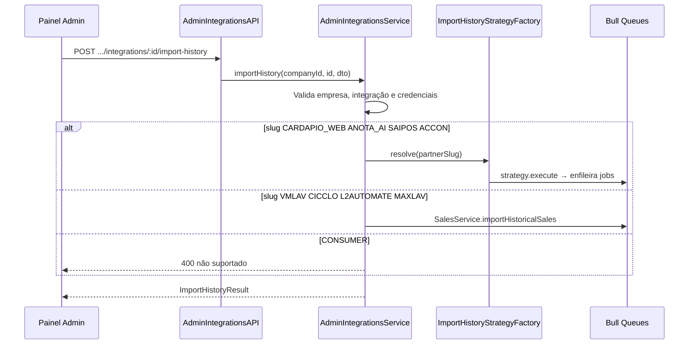

# Admin Integrations — Guia de Implementação

## Visão geral

O módulo de integrações admin permite gerenciar as **integrações de cardápio/PDV** (`DigitalMenuIntegration`) das empresas: consultar o catálogo de parceiros integradores, criar/atualizar credenciais com todos os campos suportados, ativar/desativar, remover integrações e **disparar importação de histórico de pedidos** conforme o parceiro configurado.

**Escopo deste módulo:**

- Integrações de cardápio/PDV (`Partner` + `DigitalMenuIntegration`)
- Importação retroativa de pedidos por integrador

**Fora de escopo:**

- `MetaIntegration` (WhatsApp Business API) — módulo separado
- `BusinessPartner` (revendedores) — `/admin/business-partners`
- Cadastro de novos `Partner` no admin — catálogo é somente leitura (seed/ops)

**Todos os endpoints exigem autenticação admin.** Obtenha o token em `POST /auth/login` e inclua em cada request:

```
Authorization: Bearer {{TOKEN}}
```

**Base URL:** `http://localhost:{{ADMIN_PORT}}`

**Prefixos:**

| Escopo | Prefixo |
|---|---|
| Catálogo de integradores | `/admin/integrations/partners` |
| Integrações por empresa | `/admin/companies/:companyId/integrations` |

---

## Modelo de dados

### `Partner` (integrador técnico)

| Campo | Tipo | Descrição |
|---|---|---|
| `id` | string (UUID) | Identificador |
| `name` | string | Nome exibido |
| `partnerSlug` | string | Identificador lógico (ex: `ANOTA_AI`) |
| `logoUrl` | string \| null | URL do logo |
| `baseUrlWebhook` | string \| null | URL base de webhook |
| `createdAt` | ISO 8601 | Data de criação |

### `DigitalMenuIntegration` (credenciais por empresa)

| Campo | Tipo | Descrição |
|---|---|---|
| `id` | string (UUID) | Identificador |
| `companyId` | string (UUID) | Empresa vinculada |
| `partnerId` | string (UUID) | Parceiro integrador |
| `apiKey` | string \| null | Chave de API |
| `apiSecret` | string \| null | Segredo de API |
| `username` | string \| null | Usuário (ex: Accon) |
| `password` | string \| null | Senha (ex: Accon) |
| `merchantId` | string \| null | ID da loja no parceiro |
| `digitalMenuUrl` | string \| null | URL do cardápio digital |
| `active` | boolean | Se a integração está ativa |
| `createdAt` | ISO 8601 | Data de criação |
| `updatedAt` | ISO 8601 | Última atualização |
| `partner` | objeto | Dados do `Partner` (em respostas de detalhe/lista) |

> Uma empresa pode ter **várias** integrações (uma por parceiro). A combinação `(companyId, partnerId)` é única na prática (upsert no POST).

---

## Catálogo de parceiros integradores

O endpoint `GET /admin/integrations/partners` retorna todos os parceiros do banco enriquecidos com metadados estáticos para montar formulários no painel.

### Matriz de campos e importação

| `partnerSlug` | Campos obrigatórios | Campos opcionais | Import histórico | Rota interna |
|---|---|---|---|---|
| `CARDAPIO_WEB` | `apiKey` | `apiSecret`, `merchantId`, `digitalMenuUrl` | Sim | `unified` (strategy factory) |
| `ANOTA_AI` | `apiKey` | `apiSecret`, `merchantId`, `digitalMenuUrl` | Sim | `unified` |
| `SAIPOS` | `apiKey` | `apiSecret`, `merchantId`, `digitalMenuUrl` | Sim | `unified` |
| `ACCON` | `merchantId`, `username`, `password` | `apiKey`, `apiSecret`, `digitalMenuUrl` | Sim | `unified` |
| `VMLAV` | `apiKey` (+ CNPJ da empresa) | — | Sim | `dedicated` (VmLavSalesService) |
| `CICCLO` | `merchantId`, `apiKey` | `apiSecret`, `digitalMenuUrl` | Sim | `dedicated` (CiccloSalesService) |
| `L2AUTOMATE` | `apiKey` | `merchantId`, `digitalMenuUrl` | Sim | `dedicated` (L2AutomateSalesService) |
| `MAXLAV` | `apiKey` | `merchantId`, `digitalMenuUrl` | Sim | `dedicated` (MaxlavSalesService) |
| `CONSUMER` | — (somente webhook) | — | Não | — |

**Valores de `importHistoryRoute` na resposta:**

- `unified` — usa `ImportHistoryStrategyFactory` (filas Cardápio Web, Anota AI, Saipos, Accon)
- `dedicated` — delega ao service específico do integrador
- `none` — import retroativo não suportado

### Filas Bull (referência)

| Integrador | Filas principais |
|---|---|
| Cardápio Web | `order-history-page-import` → `order-history-import` |
| Anota AI | `anota-ai-order-history-page-import` |
| Saipos | `saipos-sales-window-import` → `saipos-sale-process` |
| Accon | `accon-sales-import` → `accon-sale-process` |
| VM Lav | `vmlav-sales-import` → `vmlav-sale-process` |
| Cicclo | `cicclo-sales-import` → `cicclo-sale-process` |
| L2 Automate | `l2automate-sales-import` → `l2automate-sale-process` |
| Maxlav | `maxlav-sales-import` → `maxlav-sale-process` |

---

## Endpoints

### GET /admin/integrations/partners

Lista o catálogo de parceiros integradores com schema de campos para o formulário admin.

#### Exemplo curl

```bash
curl -X GET "{{BASE_URL}}/admin/integrations/partners" \
  -H "Authorization: Bearer {{TOKEN}}"
```

#### Resposta de sucesso — `200 OK`

```json
[
  {
    "id": "partner-anota-ai",
    "name": "Anota AI",
    "partnerSlug": "ANOTA_AI",
    "logoUrl": null,
    "baseUrlWebhook": null,
    "createdAt": "2026-01-01T00:00:00.000Z",
    "requiredFields": ["apiKey"],
    "optionalFields": ["apiSecret", "merchantId", "digitalMenuUrl"],
    "supportsImportHistory": true,
    "importHistoryRoute": "unified"
  }
]
```

#### Respostas de erro

| Status | Descrição |
|---|---|
| `401 Unauthorized` | Token ausente, inválido ou expirado |

---

### GET /admin/companies/:companyId/integrations

Lista todas as integrações de cardápio/PDV da empresa.

#### Path params

| Parâmetro | Tipo | Descrição |
|---|---|---|
| `companyId` | string (UUID) | ID da empresa |

#### Query params

| Parâmetro | Tipo | Obrigatório | Padrão | Descrição |
|---|---|---|---|---|
| `revealSecrets` | boolean | Não | `false` | Se `true`, retorna credenciais em texto claro |

#### Exemplo curl

```bash
curl -X GET "{{BASE_URL}}/admin/companies/uuid-da-empresa/integrations" \
  -H "Authorization: Bearer {{TOKEN}}"
```

#### Resposta de sucesso — `200 OK`

```json
[
  {
    "id": "uuid-integracao",
    "companyId": "uuid-da-empresa",
    "partnerId": "partner-anota-ai",
    "apiKey": "••••••••",
    "apiSecret": null,
    "username": null,
    "password": null,
    "merchantId": null,
    "digitalMenuUrl": null,
    "active": true,
    "hasApiKey": true,
    "hasApiSecret": false,
    "hasUsername": false,
    "hasPassword": false,
    "createdAt": "2026-01-10T10:00:00.000Z",
    "updatedAt": "2026-01-10T10:00:00.000Z",
    "partner": {
      "id": "partner-anota-ai",
      "name": "Anota AI",
      "partnerSlug": "ANOTA_AI",
      "logoUrl": null,
      "baseUrlWebhook": null
    }
  }
]
```

#### Respostas de erro

| Status | Mensagem | Descrição |
|---|---|---|
| `401 Unauthorized` | — | Token ausente, inválido ou expirado |
| `404 Not Found` | `"Empresa não encontrada"` | `companyId` inválido |

---

### GET /admin/companies/:companyId/integrations/:id

Retorna uma integração pelo ID.

#### Path params

| Parâmetro | Tipo | Descrição |
|---|---|---|
| `companyId` | string (UUID) | ID da empresa |
| `id` | string (UUID) | ID da integração |

#### Query params

| Parâmetro | Tipo | Obrigatório | Padrão | Descrição |
|---|---|---|---|---|
| `revealSecrets` | boolean | Não | `false` | Se `true`, retorna credenciais em texto claro |

#### Exemplo curl

```bash
curl -X GET "{{BASE_URL}}/admin/companies/uuid-da-empresa/integrations/uuid-integracao" \
  -H "Authorization: Bearer {{TOKEN}}"
```

#### Resposta de sucesso — `200 OK`

Mesma estrutura do item da listagem, com `partner` embutido.

#### Respostas de erro

| Status | Mensagem | Descrição |
|---|---|---|
| `401 Unauthorized` | — | Token ausente, inválido ou expirado |
| `404 Not Found` | `"Empresa não encontrada"` | Empresa inexistente |
| `404 Not Found` | `"Integração não encontrada"` | ID inexistente ou não pertence à empresa |

---

### POST /admin/companies/:companyId/integrations

Cria ou atualiza (upsert) uma integração para o parceiro informado. Se já existir integração com o mesmo `(companyId, partnerId)`, os campos são atualizados.

Valida campos obrigatórios conforme o `partnerSlug` do `partnerId` selecionado.

#### Path params

| Parâmetro | Tipo | Descrição |
|---|---|---|
| `companyId` | string (UUID) | ID da empresa |

#### Body

```json
{
  "partnerId": "partner-anota-ai",
  "apiKey": "sua-api-key",
  "apiSecret": "opcional",
  "username": "opcional",
  "password": "opcional",
  "merchantId": "opcional",
  "digitalMenuUrl": "https://menu.exemplo.com",
  "active": true
}
```

| Campo | Tipo | Obrigatório | Descrição |
|---|---|---|---|
| `partnerId` | string (UUID) | Sim | ID do parceiro integrador |
| `apiKey` | string | Condicional | Obrigatório para slugs que exigem `apiKey` |
| `apiSecret` | string | Não | Segredo de API |
| `username` | string | Condicional | Obrigatório para `ACCON` |
| `password` | string | Condicional | Obrigatório para `ACCON` |
| `merchantId` | string | Condicional | Obrigatório para `ACCON`, `CICCLO` |
| `digitalMenuUrl` | string | Não | URL do cardápio |
| `active` | boolean | Não | Padrão: `true` |

#### Exemplo curl

```bash
curl -X POST "{{BASE_URL}}/admin/companies/uuid-da-empresa/integrations" \
  -H "Authorization: Bearer {{TOKEN}}" \
  -H "Content-Type: application/json" \
  -d '{
    "partnerId": "partner-anota-ai",
    "apiKey": "sua-api-key",
    "active": true
  }'
```

#### Resposta de sucesso — `201 Created` (nova) / `200 OK` (upsert)

Integração criada/atualizada (credenciais mascaradas por padrão).

#### Respostas de erro

| Status | Mensagem | Descrição |
|---|---|---|
| `400 Bad Request` | Mensagem de validação por campo | Campos obrigatórios ausentes para o parceiro |
| `400 Bad Request` | `"Parceiro integrador não encontrado"` | `partnerId` inválido |
| `401 Unauthorized` | — | Token ausente, inválido ou expirado |
| `404 Not Found` | `"Empresa não encontrada"` | Empresa inexistente |

---

### PATCH /admin/companies/:companyId/integrations/:id

Atualiza credenciais e metadados de uma integração existente. Campos omitidos no body **não** são alterados.

#### Body

Mesmos campos do POST, exceto `partnerId` (não pode ser alterado).

```json
{
  "apiKey": "nova-api-key",
  "active": true
}
```

#### Exemplo curl

```bash
curl -X PATCH "{{BASE_URL}}/admin/companies/uuid-da-empresa/integrations/uuid-integracao" \
  -H "Authorization: Bearer {{TOKEN}}" \
  -H "Content-Type: application/json" \
  -d '{ "apiKey": "nova-api-key" }'
```

#### Resposta de sucesso — `200 OK`

Integração atualizada.

#### Respostas de erro

| Status | Mensagem | Descrição |
|---|---|---|
| `400 Bad Request` | Validação por slug | Campos obrigatórios inválidos após merge |
| `401 Unauthorized` | — | Token ausente |
| `404 Not Found` | `"Integração não encontrada"` | ID inválido |

---

### PATCH /admin/companies/:companyId/integrations/:id/active

Ativa ou desativa a integração sem alterar credenciais.

#### Body

```json
{
  "active": false
}
```

| Campo | Tipo | Obrigatório | Descrição |
|---|---|---|---|
| `active` | boolean | Sim | `true` para ativar, `false` para desativar |

#### Exemplo curl

```bash
curl -X PATCH "{{BASE_URL}}/admin/companies/uuid-da-empresa/integrations/uuid-integracao/active" \
  -H "Authorization: Bearer {{TOKEN}}" \
  -H "Content-Type: application/json" \
  -d '{ "active": false }'
```

#### Resposta de sucesso — `200 OK`

Integração com `active` atualizado.

---

### DELETE /admin/companies/:companyId/integrations/:id

Remove uma integração. Pode falhar se houver pedidos vinculados (`digitalMenuIntegrationId`) com restrição de FK.

#### Exemplo curl

```bash
curl -X DELETE "{{BASE_URL}}/admin/companies/uuid-da-empresa/integrations/uuid-integracao" \
  -H "Authorization: Bearer {{TOKEN}}"
```

#### Resposta de sucesso — `200 OK`

Corpo vazio.

#### Respostas de erro

| Status | Descrição |
|---|---|
| `404 Not Found` | Integração ou empresa não encontrada |
| `409 Conflict` | Registros dependentes impedem exclusão |

---

### POST /admin/companies/:companyId/integrations/:id/import-history

Dispara a importação retroativa de pedidos para a integração informada.

**Período padrão:** últimos 90 dias até hoje. Pode ser customizado com `startDate` e `endDate`.

#### Body

```json
{
  "startDate": "2026-02-01",
  "endDate": "2026-05-22"
}
```

| Campo | Tipo | Obrigatório | Descrição |
|---|---|---|---|
| `startDate` | string (YYYY-MM-DD) | Não | Data inicial |
| `endDate` | string (YYYY-MM-DD) | Não | Data final |

#### Exemplo curl

```bash
curl -X POST "{{BASE_URL}}/admin/companies/uuid-da-empresa/integrations/uuid-integracao/import-history" \
  -H "Authorization: Bearer {{TOKEN}}" \
  -H "Content-Type: application/json" \
  -d '{
    "startDate": "2026-02-01",
    "endDate": "2026-05-22"
  }'
```

#### Resposta de sucesso — `200 OK`

```json
{
  "message": "Importação histórica iniciada com sucesso",
  "startDate": "2026-02-01",
  "endDate": "2026-05-22",
  "totalDays": 81,
  "jobsCreated": 81
}
```

> A mensagem exata pode variar por integrador (ex: `"Importação histórica Accon iniciada com sucesso"`).

#### Respostas de erro

| Status | Mensagem | Descrição |
|---|---|---|
| `400 Bad Request` | `"Este parceiro não suporta importação de histórico"` | Ex: `CONSUMER` |
| `400 Bad Request` | `"Integração inativa"` | `active: false` |
| `401 Unauthorized` | — | Token ausente |
| `404 Not Found` | `"Integração não encontrada"` | ID inválido |
| `404 Not Found` | `"Integração não configurada: API Key ausente"` | Credenciais insuficientes |
| `404 Not Found` | `"Integração não configurada: parceiro sem identificador"` | `partnerSlug` ausente |
| `404 Not Found` | `"parceiro \"X\" não possui estratégia de importação"` | Slug sem implementação |

---

## Fluxo de importação (admin)



---

## Notas de implementação (backend)

| Componente | Caminho |
|---|---|
| Módulo | `src/admin/integrations/admin-integrations.module.ts` |
| Service | `src/admin/integrations/admin-integrations.service.ts` |
| Catálogo | `src/admin/integrations/admin-integrations.controller.ts` |
| CRUD por empresa | `src/admin/integrations/admin-company-integrations.controller.ts` |
| Metadados por slug | `src/admin/integrations/partner-field-catalog.ts` |
| Repositório estendido | `findAllByCompanyId`, `delete` em `DigitalMenuIntegrationPrismaRepository` |

**Serviços reutilizados:**

- `OnboardingService.createDigitalMenuIntegration` (lógica de upsert) — replicada no `AdminIntegrationsService`
- `ImportHistoryStrategyFactory` + strategies (Cardápio Web, Anota AI, Saipos, Accon)
- `VmLavSalesService`, `CiccloSalesService`, `L2AutomateSalesService`, `MaxlavSalesService` (import dedicado)

**Mascaramento de segredos:** por padrão `apiKey`, `apiSecret`, `username` e `password` retornam `••••••••` quando preenchidos; flags `hasApiKey`, `hasApiSecret`, `hasUsername`, `hasPassword` indicam presença. Use `?revealSecrets=true` para texto claro (somente admin autenticado).

---

## Checklist de testes manuais

- [ ] `GET /admin/integrations/partners` retorna catálogo com `requiredFields` e `importHistoryRoute`
- [ ] `POST` cria integração Anota AI com `apiKey`
- [ ] `POST` com mesmo `partnerId` faz upsert (não duplica)
- [ ] `POST` Accon falha sem `username`/`password`/`merchantId`
- [ ] `GET` lista com credenciais mascaradas; `revealSecrets=true` mostra valores
- [ ] `PATCH` atualiza `apiKey` parcialmente
- [ ] `PATCH .../active` desativa integração
- [ ] `POST .../import-history` enfileira jobs para Anota AI / Cardápio Web
- [ ] `POST .../import-history` retorna 400 para Consumer
- [ ] `DELETE` remove integração sem pedidos vinculados
