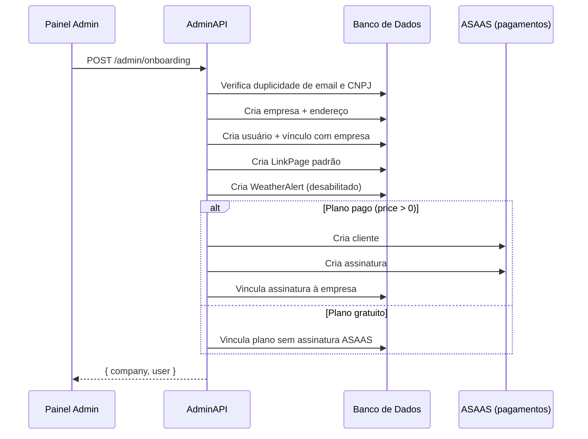

# Admin Onboarding — Guia de Implementação

## Visão geral

O módulo de onboarding admin encapsula o fluxo completo de cadastro de um novo cliente na plataforma: cria a empresa, o usuário proprietário, a estrutura de links, configura a assinatura (ASAAS) se o plano for pago, provisiona o agente de IA e cria a configuração RFV padrão — tudo em uma única requisição com rollback automático em caso de falha.

Use este endpoint quando quiser cadastrar um novo cliente pelo painel administrativo sem precisar fazer múltiplas chamadas separadas.

**Requer autenticação.** Obtenha o token em `POST /auth/login` e inclua no header:

```
Authorization: Bearer {{TOKEN}}
```

**Base URL:** `http://localhost:{{ADMIN_PORT}}`
**Prefixo:** `/admin/onboarding`

---

## O que acontece internamente



> **Aviso de performance:** Este endpoint executa várias operações encadeadas (banco de dados + API externa ASAAS). Para planos pagos, pode levar de 3 a 10 segundos. Implemente um indicador de carregamento na UI e não faça retry imediato em caso de timeout.

> **Rollback automático:** Se qualquer etapa após a criação da empresa falhar, todos os registros criados são removidos automaticamente, garantindo consistência.

---

## Endpoints

### POST /admin/onboarding

Cria uma empresa e um usuário proprietário via fluxo completo de onboarding.

#### Body

```json
{
  "company": {
    "name": "Pizzaria Exemplo",
    "cnpj": "12345678000190",
    "email": "contato@pizzaria.com",
    "phone": "(11) 99999-9999",
    "zipCode": "01310-100",
    "street": "Avenida Paulista",
    "number": "1000",
    "complement": "Sala 1",
    "neighborhood": "Bela Vista",
    "city": "São Paulo",
    "state": "SP"
  },
  "name": "João Silva",
  "email": "joao@pizzaria.com",
  "password": "senha123",
  "phone": "(11) 99999-9999",
  "planId": "uuid-do-plano",
  "businessPartnerId": null
}
```

#### Campos do objeto `company`

| Campo | Tipo | Obrigatório | Descrição |
|---|---|---|---|
| `name` | string | Sim | Nome da empresa |
| `cnpj` | string | Sim | CNPJ único (somente números ou formatado) |
| `email` | string (email) | Sim | Email de contato da empresa |
| `phone` | string | Sim | Telefone de contato |
| `zipCode` | string | Sim | CEP |
| `street` | string | Sim | Rua/Avenida |
| `number` | string | Sim | Número |
| `complement` | string | Não | Complemento do endereço |
| `neighborhood` | string | Sim | Bairro |
| `city` | string | Sim | Cidade |
| `state` | string | Sim | UF (ex: `SP`) |

#### Campos raiz (dados do usuário proprietário)

| Campo | Tipo | Obrigatório | Descrição |
|---|---|---|---|
| `name` | string | Sim | Nome completo do usuário |
| `email` | string (email) | Sim | Email único do usuário |
| `password` | string | Sim | Senha em texto plano (será hasheada) |
| `phone` | string | Sim | Telefone do usuário |
| `planId` | string (UUID) | Sim | ID do plano contratado |
| `businessPartnerId` | string (UUID) | Não | ID do parceiro de negócio (revendedor) |

#### Exemplo curl

```bash
curl -X POST "{{BASE_URL}}/admin/onboarding" \
  -H "Authorization: Bearer {{TOKEN}}" \
  -H "Content-Type: application/json" \
  -d '{
    "company": {
      "name": "Pizzaria Exemplo",
      "cnpj": "12345678000190",
      "email": "contato@pizzaria.com",
      "phone": "(11) 99999-9999",
      "zipCode": "01310-100",
      "street": "Avenida Paulista",
      "number": "1000",
      "neighborhood": "Bela Vista",
      "city": "São Paulo",
      "state": "SP"
    },
    "name": "João Silva",
    "email": "joao@pizzaria.com",
    "password": "senha123",
    "phone": "(11) 99999-9999",
    "planId": "uuid-do-plano"
  }'
```

#### Resposta de sucesso — `201 Created`

```json
{
  "company": {
    "id": "uuid-da-empresa",
    "name": "Pizzaria Exemplo",
    "cnpj": "12345678000190",
    "email": "contato@pizzaria.com",
    "phone": "(11) 99999-9999",
    "avatarUrl": null,
    "slug": "pizzaria-exemplo",
    "state": "PENDING",
    "businessPartnerId": null,
    "addressId": "uuid-do-endereco",
    "address": {
      "id": "uuid-do-endereco",
      "zipCode": "01310-100",
      "street": "Avenida Paulista",
      "number": "1000",
      "complement": null,
      "neighborhood": "Bela Vista",
      "city": "São Paulo",
      "state": "SP"
    },
    "createdAt": "2026-05-22T10:00:00.000Z",
    "updatedAt": "2026-05-22T10:00:00.000Z"
  },
  "user": {
    "id": "uuid-do-usuario",
    "name": "João Silva",
    "email": "joao@pizzaria.com",
    "phone": "(11) 99999-9999"
  }
}
```

> O campo `password` nunca aparece na resposta.

> O `slug` da empresa é gerado automaticamente a partir do nome (`name`). Se já existir um slug igual, é acrescentado o bairro como sufixo.

#### Respostas de erro

**`400 Bad Request` — Email de usuário já cadastrado**

```json
{
  "statusCode": 400,
  "message": "Já existe um usuário cadastrado com este email",
  "error": "Bad Request"
}
```

**`400 Bad Request` — CNPJ de empresa já cadastrado**

```json
{
  "statusCode": 400,
  "message": "Já existe uma empresa cadastrada com este CNPJ",
  "error": "Bad Request"
}
```

**`400 Bad Request` — Plano não encontrado**

```json
{
  "statusCode": 400,
  "message": "Plano não encontrado",
  "error": "Bad Request"
}
```

**`400 Bad Request` — Falha no fluxo com rollback**

Ocorre quando alguma etapa intermediária falha (ex: erro na API do ASAAS). Todos os registros criados são removidos automaticamente.

```json
{
  "statusCode": 400,
  "message": "Ocorreu um erro ao realizar o cadastro: <detalhe do erro>",
  "error": "Bad Request"
}
```

**`400 Bad Request` — Validação de campos**

```json
{
  "statusCode": 400,
  "message": [
    "company.name must be a string",
    "email must be an email"
  ],
  "error": "Bad Request"
}
```

**`401 Unauthorized` — Token ausente ou inválido**

```json
{
  "statusCode": 401,
  "message": "Unauthorized",
  "error": "Unauthorized"
}
```

---

## Como obter os IDs de planos disponíveis

Antes de chamar este endpoint, consulte os planos ativos via API principal (não-admin). O `planId` deve corresponder a um plano existente e ativo no banco.

Se o plano tiver `price = 0`, nenhuma integração com o ASAAS é realizada e o cliente não recebe cobrança. Caso contrário, um cliente e uma assinatura são criados no ASAAS automaticamente.
