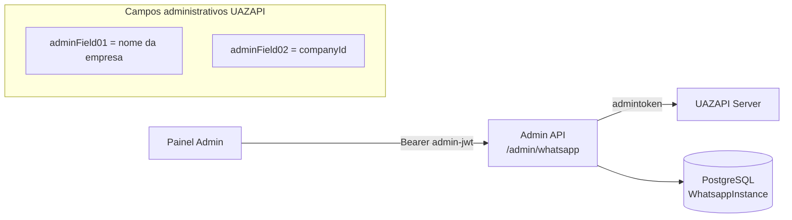
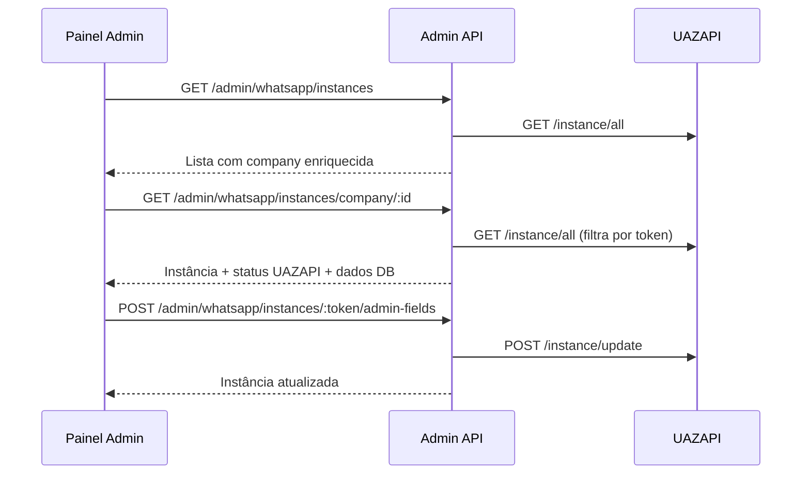

# Admin WhatsApp (UAZAPI) — Guia de Implementação

## Visão geral

O módulo admin de WhatsApp expõe os endpoints de **administração da UAZAPI** dentro da API Admin, permitindo gerenciar instâncias, webhook global e operações de sistema do servidor WhatsApp.

Cada instância UAZAPI pode ser vinculada a uma empresa da plataforma. O vínculo é feito pelo campo `adminField02`, que armazena o `companyId`. Na criação pelo fluxo normal da plataforma, `adminField01` recebe o nome da empresa e `adminField02` o ID.

**Todos os endpoints exigem autenticação admin.** Obtenha o token em `POST /auth/login` e inclua em cada request:

```
Authorization: Bearer {{TOKEN}}
```

**Base URL:** `http://localhost:{{ADMIN_PORT}}`
**Prefixo:** `/admin/whatsapp`

**Documentação UAZAPI:** [Administração — uazapiGO V2](https://docs.uazapi.com/tag/Admininstra%C3%A7%C3%A3o)

---

## Variáveis de ambiente

| Variável | Descrição |
|---|---|
| `UAZAPI_API_URL` | Base URL do servidor UAZAPI (ex: `https://foodcrm.uazapi.com`) |
| `UAZAPI_ADMIN_API_KEY` | Token administrativo usado internamente pelo backend (header `admintoken`) |
| `WEBHOOK_URL` | URL usada no fluxo normal de criação de instância pela plataforma |

> O frontend **nunca** deve receber ou enviar o `UAZAPI_ADMIN_API_KEY`. Todos os endpoints admin passam pelo backend, que faz a autenticação com a UAZAPI.

---

## Status de instância

### Na UAZAPI

| Valor | Descrição |
|---|---|
| `connected` | Conectado e autenticado no WhatsApp |
| `connecting` | Em processo de conexão |
| `disconnected` | Desconectado do WhatsApp |
| `pending` | Aguardando leitura do QR Code |

### No banco de dados (`WhatsappInstanceStatus`)

| Valor | Descrição |
|---|---|
| `CONNECTED` | Instância conectada |
| `DISCONNECTED` | Instância desconectada |
| `PENDING` | Aguardando conexão |
| `ERROR` | Erro na instância |

---

## Mapeamento empresa ↔ instância



| Campo UAZAPI | Uso na plataforma |
|---|---|
| `adminField01` | Nome legível da empresa (ex: `"Pizzaria Exemplo"`) |
| `adminField02` | ID da empresa no banco (`companyId`) |
| `systemName` | Nome do sistema exibido na instância (ex: `"FoodCRM"`) |
| `token` | Token único da instância — usado para operações por instância |

---

## Endpoints

### GET /admin/whatsapp/instances

Lista **todas** as instâncias registradas na UAZAPI, enriquecidas com os dados da empresa correspondente do nosso banco (quando `adminField02` estiver preenchido).

Equivalente UAZAPI: `GET /instance/all`

#### Exemplo curl

```bash
curl -X GET "{{BASE_URL}}/admin/whatsapp/instances" \
  -H "Authorization: Bearer {{TOKEN}}"
```

#### Resposta de sucesso — `200 OK`

```json
[
  {
    "id": "uuid-uazapi",
    "token": "token-da-instancia",
    "name": "pizzaria-exemplo",
    "status": "connected",
    "lastDisconnect": null,
    "updated": "2026-05-22T10:00:00.000Z",
    "created": "2026-01-10T10:00:00.000Z",
    "adminField01": "Pizzaria Exemplo",
    "adminField02": "uuid-da-empresa",
    "systemName": "FoodCRM",
    "company": {
      "id": "uuid-da-empresa",
      "name": "Pizzaria Exemplo",
      "email": "contato@pizzaria.com",
      "cnpj": "12345678000190",
      "state": "ACTIVE"
    }
  },
  {
    "id": "uuid-uazapi-2",
    "token": "token-sem-vinculo",
    "name": "instancia-orfa",
    "status": "disconnected",
    "lastDisconnect": "2026-05-20T08:00:00.000Z",
    "updated": "2026-05-20T08:00:00.000Z",
    "created": "2026-03-01T10:00:00.000Z",
    "adminField01": null,
    "adminField02": null,
    "systemName": null,
    "company": null
  }
]
```

> Instâncias sem `adminField02` retornam `company: null`. Isso indica instâncias criadas diretamente na UAZAPI ou sem vínculo com a plataforma.

#### Respostas de erro

| Status | Descrição |
|---|---|
| `401 Unauthorized` | Token admin ausente, inválido ou expirado |
| `500 Internal Server Error` | Falha na comunicação com a UAZAPI |

---

### GET /admin/whatsapp/instances/company/:companyId

Retorna a instância vinculada a uma empresa específica, combinando dados do banco local (`WhatsappInstance`) com o status atual na UAZAPI.

#### Path params

| Parâmetro | Tipo | Descrição |
|---|---|---|
| `companyId` | string (UUID) | ID da empresa |

#### Exemplo curl

```bash
curl -X GET "{{BASE_URL}}/admin/whatsapp/instances/company/uuid-da-empresa" \
  -H "Authorization: Bearer {{TOKEN}}"
```

#### Resposta de sucesso — `200 OK` (com instância)

```json
{
  "company": {
    "id": "uuid-da-empresa",
    "name": "Pizzaria Exemplo",
    "email": "contato@pizzaria.com",
    "state": "ACTIVE"
  },
  "instance": {
    "id": "uuid-instancia-db",
    "name": "pizzaria-exemplo",
    "status": "CONNECTED",
    "token": "token-da-instancia",
    "phoneNumber": "5511999999999",
    "companyId": "uuid-da-empresa",
    "createdAt": "2026-01-10T10:00:00.000Z",
    "updatedAt": "2026-05-22T10:00:00.000Z",
    "uazapi": {
      "id": "uuid-uazapi",
      "token": "token-da-instancia",
      "name": "pizzaria-exemplo",
      "status": "connected",
      "lastDisconnect": null,
      "updated": "2026-05-22T10:00:00.000Z",
      "created": "2026-01-10T10:00:00.000Z",
      "adminField01": "Pizzaria Exemplo",
      "adminField02": "uuid-da-empresa",
      "systemName": "FoodCRM"
    }
  }
}
```

#### Resposta de sucesso — `200 OK` (sem instância)

```json
{
  "company": {
    "id": "uuid-da-empresa",
    "name": "Pizzaria Exemplo",
    "email": "contato@pizzaria.com",
    "state": "ACTIVE"
  },
  "instance": null
}
```

#### Respostas de erro

| Status | Mensagem | Descrição |
|---|---|---|
| `401 Unauthorized` | — | Token ausente, inválido ou expirado |
| `404 Not Found` | `"Empresa não encontrada"` | `companyId` não existe no banco |

---

### POST /admin/whatsapp/instances

Cria uma nova instância diretamente na UAZAPI. **Não persiste** registro na tabela `WhatsappInstance` do banco — apenas cria na UAZAPI com `adminField02` preenchido com o `companyId`.

Equivalente UAZAPI: `POST /instance/init`

> Para o fluxo completo da plataforma (criação na UAZAPI + persistência no banco + webhook + QR Code), use `POST /whatsapp/companies/:companyId/instances` na API principal.

#### Body

```json
{
  "name": "pizzaria-exemplo",
  "companyId": "uuid-da-empresa"
}
```

| Campo | Tipo | Obrigatório | Descrição |
|---|---|---|---|
| `name` | string | Sim | Nome/slug da instância na UAZAPI (URL-friendly, sem espaços) |
| `companyId` | string (UUID) | Sim | ID da empresa — salvo em `adminField02` na UAZAPI |

#### Exemplo curl

```bash
curl -X POST "{{BASE_URL}}/admin/whatsapp/instances" \
  -H "Authorization: Bearer {{TOKEN}}" \
  -H "Content-Type: application/json" \
  -d '{
    "name": "pizzaria-exemplo",
    "companyId": "uuid-da-empresa"
  }'
```

#### Resposta de sucesso — `201 Created`

```json
{
  "response": "Instance created",
  "instance": {
    "id": "uuid-uazapi",
    "token": "token-gerado",
    "status": "disconnected",
    "paircode": "",
    "qrcode": "",
    "name": "pizzaria-exemplo",
    "profileName": "",
    "profilePicUrl": "",
    "isBusiness": false,
    "plataform": "",
    "systemName": "",
    "owner": "",
    "lastDisconnect": "",
    "lastDisconnectReason": "",
    "adminField01": "",
    "adminField02": "uuid-da-empresa",
    "created": "2026-05-22T10:00:00.000Z",
    "updated": "2026-05-22T10:00:00.000Z"
  },
  "connected": false,
  "loggedIn": false,
  "name": "pizzaria-exemplo",
  "token": "token-gerado",
  "info": "Instância criada com sucesso"
}
```

#### Respostas de erro

| Status | Descrição |
|---|---|
| `401 Unauthorized` | Token admin ausente, inválido ou expirado |
| `429 Too Many Requests` | Limite de instâncias do servidor UAZAPI atingido |
| `500 Internal Server Error` | Falha na comunicação com a UAZAPI |

---

### POST /admin/whatsapp/instances/:instanceToken/admin-fields

Atualiza os campos administrativos de uma instância existente na UAZAPI.

Equivalente UAZAPI: `POST /instance/update`

#### Path params

| Parâmetro | Tipo | Descrição |
|---|---|---|
| `instanceToken` | string | Token da instância UAZAPI |

#### Body

```json
{
  "adminField01": "Pizzaria Exemplo",
  "adminField02": "uuid-da-empresa",
  "systemName": "FoodCRM"
}
```

| Campo | Tipo | Obrigatório | Descrição |
|---|---|---|---|
| `adminField01` | string | Não | Campo livre 1 (ex: nome da empresa) |
| `adminField02` | string | Não | Campo livre 2 (ex: `companyId` da plataforma) |
| `systemName` | string | Não | Nome do sistema exibido na instância |

> Envie apenas os campos que deseja alterar. Todos são opcionais.

#### Exemplo curl

```bash
curl -X POST "{{BASE_URL}}/admin/whatsapp/instances/token-da-instancia/admin-fields" \
  -H "Authorization: Bearer {{TOKEN}}" \
  -H "Content-Type: application/json" \
  -d '{
    "adminField01": "Pizzaria Exemplo",
    "adminField02": "uuid-da-empresa",
    "systemName": "FoodCRM"
  }'
```

#### Resposta de sucesso — `201 Created`

Retorna o objeto atualizado da instância conforme resposta da UAZAPI.

#### Respostas de erro

| Status | Descrição |
|---|---|
| `401 Unauthorized` | Token admin ausente, inválido ou expirado |
| `500 Internal Server Error` | Instância não encontrada na UAZAPI ou falha de comunicação |

---

### GET /admin/whatsapp/webhook/global

Retorna a configuração atual do webhook global da UAZAPI.

Equivalente UAZAPI: `GET /admin/webhook`

#### Exemplo curl

```bash
curl -X GET "{{BASE_URL}}/admin/whatsapp/webhook/global" \
  -H "Authorization: Bearer {{TOKEN}}"
```

#### Resposta de sucesso — `200 OK`

```json
{
  "enabled": true,
  "url": "https://api.foodcrm.fun/whatsapp/webhook",
  "events": ["connection", "messages"]
}
```

> A estrutura exata depende da versão da UAZAPI. Trate como objeto genérico e exiba os campos retornados.

#### Respostas de erro

| Status | Descrição |
|---|---|
| `401 Unauthorized` | Token admin ausente, inválido ou expirado |
| `500 Internal Server Error` | Falha na comunicação com a UAZAPI |

---

### POST /admin/whatsapp/webhook/global

Configura o webhook global da UAZAPI. Diferente do webhook por instância, o webhook global recebe eventos de **todas** as instâncias do servidor.

Equivalente UAZAPI: `POST /admin/webhook`

#### Body

```json
{
  "enabled": true,
  "url": "https://api.foodcrm.fun/whatsapp/webhook",
  "events": ["connection", "messages"]
}
```

| Campo | Tipo | Obrigatório | Descrição |
|---|---|---|---|
| `enabled` | boolean | Sim | Habilitar ou desabilitar o webhook global |
| `url` | string (URL) | Sim | URL de destino dos eventos |
| `events` | string[] | Não | Lista de eventos (ex: `connection`, `messages`) |

#### Exemplo curl

```bash
curl -X POST "{{BASE_URL}}/admin/whatsapp/webhook/global" \
  -H "Authorization: Bearer {{TOKEN}}" \
  -H "Content-Type: application/json" \
  -d '{
    "enabled": true,
    "url": "https://api.foodcrm.fun/whatsapp/webhook",
    "events": ["connection", "messages"]
  }'
```

#### Resposta de sucesso — `201 Created`

Retorna a configuração aplicada conforme resposta da UAZAPI.

#### Respostas de erro

| Status | Descrição |
|---|---|
| `400 Bad Request` | URL inválida ou campo obrigatório ausente |
| `401 Unauthorized` | Token admin ausente, inválido ou expirado |
| `500 Internal Server Error` | Falha na comunicação com a UAZAPI |

---

### GET /admin/whatsapp/webhook/global/errors

Retorna os últimos erros registrados pelo webhook global da UAZAPI. Útil para diagnosticar falhas de entrega de eventos.

Equivalente UAZAPI: `GET /admin/webhook/errors`

#### Exemplo curl

```bash
curl -X GET "{{BASE_URL}}/admin/whatsapp/webhook/global/errors" \
  -H "Authorization: Bearer {{TOKEN}}"
```

#### Resposta de sucesso — `200 OK`

```json
[
  {
    "timestamp": "2026-05-22T09:30:00.000Z",
    "url": "https://api.foodcrm.fun/whatsapp/webhook",
    "statusCode": 500,
    "error": "Internal Server Error"
  }
]
```

> A estrutura exata depende da UAZAPI. Exiba como lista de erros com timestamp, URL e mensagem.

#### Respostas de erro

| Status | Descrição |
|---|---|
| `401 Unauthorized` | Token admin ausente, inválido ou expirado |
| `500 Internal Server Error` | Falha na comunicação com a UAZAPI |

---

### POST /admin/whatsapp/restart

Reinicia a aplicação UAZAPI. Todas as instâncias conectadas serão desconectadas e reconectadas automaticamente após o restart.

Equivalente UAZAPI: `POST /admin/restart`

> **Atenção:** Operação destrutiva. Todas as instâncias ficarão temporariamente offline. Use apenas em manutenção programada.

#### Exemplo curl

```bash
curl -X POST "{{BASE_URL}}/admin/whatsapp/restart" \
  -H "Authorization: Bearer {{TOKEN}}"
```

#### Resposta de sucesso — `201 Created`

```json
{
  "message": "Application restart initiated"
}
```

#### Respostas de erro

| Status | Descrição |
|---|---|
| `401 Unauthorized` | Token admin ausente, inválido ou expirado |
| `500 Internal Server Error` | Falha na comunicação com a UAZAPI |

---

### POST /admin/whatsapp/token/rotate

Rotaciona o admin token da UAZAPI, invalidando o token atual.

Equivalente UAZAPI: `POST /admin/token`

> **Atenção crítica:** Após rotacionar, o valor retornado deve ser atualizado imediatamente na variável de ambiente `UAZAPI_ADMIN_API_KEY` do servidor. Caso contrário, todos os endpoints admin de WhatsApp deixarão de funcionar até a atualização.

#### Exemplo curl

```bash
curl -X POST "{{BASE_URL}}/admin/whatsapp/token/rotate" \
  -H "Authorization: Bearer {{TOKEN}}"
```

#### Resposta de sucesso — `201 Created`

```json
{
  "token": "novo-admin-token-gerado"
}
```

> Copie o valor de `token` e atualize `UAZAPI_ADMIN_API_KEY` no ambiente de produção/staging.

#### Respostas de erro

| Status | Descrição |
|---|---|
| `401 Unauthorized` | Token admin ausente, inválido ou expirado |
| `500 Internal Server Error` | Falha na comunicação com a UAZAPI |

---

## Fluxo recomendado no painel admin



### Tela de listagem de instâncias

1. Chamar `GET /admin/whatsapp/instances`
2. Exibir colunas: nome, status UAZAPI, empresa vinculada (`company.name`), telefone, última desconexão
3. Destacar instâncias com `company: null` (órfãs)
4. Permitir filtrar por status (`connected`, `disconnected`, `pending`)

### Tela de detalhe por empresa

1. Chamar `GET /admin/whatsapp/instances/company/:companyId`
2. Se `instance: null`, exibir estado "sem instância"
3. Se existir, exibir status local (`CONNECTED`/`DISCONNECTED`/`PENDING`) e status UAZAPI lado a lado
4. Botão para editar campos admin via `POST /admin/whatsapp/instances/:token/admin-fields`

### Tela de configuração do servidor

1. `GET /admin/whatsapp/webhook/global` — exibir configuração atual
2. `GET /admin/whatsapp/webhook/global/errors` — exibir erros recentes
3. Formulário para `POST /admin/whatsapp/webhook/global`
4. Botões de ação com confirmação: restart e rotate token

---

## Diferença entre endpoints admin e API principal

| Operação | Admin (`/admin/whatsapp`) | API principal (`/whatsapp`) |
|---|---|---|
| Listar todas as instâncias UAZAPI | `GET /admin/whatsapp/instances` | — |
| Instância de uma empresa | `GET /admin/whatsapp/instances/company/:id` | `GET /whatsapp/companies/:id/instances/status` |
| Criar instância (só UAZAPI) | `POST /admin/whatsapp/instances` | — |
| Criar instância (fluxo completo) | — | `POST /whatsapp/companies/:id/instances` |
| Conectar / QR Code | — | `GET /whatsapp/companies/:id/instances/connection` |
| Deletar instância | — | `DELETE /whatsapp/companies/:id/instances` |
| Webhook global | `GET/POST /admin/whatsapp/webhook/global` | — |
| Restart / Rotate token | `POST /admin/whatsapp/restart` / `token/rotate` | — |
