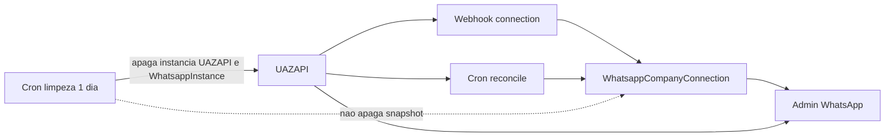

# Visibilidade de desconexão WhatsApp no admin

**Data:** 2026-09-09
**Status:** Aprovado
**Contexto:** A lista de desconectados no admin some após a limpeza de 1 dia na UAZAPI; status inconsistente com nomes duplicados na assinatura compartilhada; cliente pediu visão interna (empresa + data), sem e-mail.

## Objetivo

1. Corrigir o status inconsistente (lookup por token, não só por nome).
2. Persistir no nosso banco quem desconectou e quando, sobrevivendo à limpeza de 1 dia.
3. Expor no admin interno uma lista “sem conexão” com empresa e data — sem e-mail/push.

## Decisões de produto

| Regra | Valor |
|-------|-------|
| Alerta neste ciclo | Só dashboard admin (sem e-mail/Slack) |
| Limpeza UAZAPI 1 dia | Mantida |
| Histórico | Snapshot por empresa no Postgres |
| Duplicatas | Linhas distintas; fonte da verdade = `companyId` + token |
| Fora de escopo | E-mail ao cliente, push interno, auto-limpeza de órfãs, mudar TTL |

## Arquitetura

### Modelo `WhatsappCompanyConnection`

Uma linha por `companyId`:

| Campo | Uso |
|-------|-----|
| `companyId` | Unique; empresa LavPerform |
| `instanceToken` | Nullable após limpeza |
| `instanceName` | Nome na UAZAPI |
| `systemName` | Ex.: LavPerform / FoodCRM |
| `status` | `connected` / `disconnected` / `connecting` / `pending` / `absent` |
| `lastDisconnectedAt` | Preservado mesmo se instância sumir |
| `lastConnectedAt` | Última conexão conhecida |
| `lastReconciledAt` | Último sync com UAZAPI |

### Atualização

- **Webhook `connection`:** localizar `WhatsappInstance` por **token** (fallback nome se token ausente); atualizar status no banco e o snapshot; em desconexão preencher `lastDisconnectedAt`.
- **Reconcile (a cada 30 min):** `getAllInstances()`, cruzar por token/`adminField02`; token sumiu → `status = absent`, preservar data.
- **Limpeza 1 dia:** não apaga o snapshot.

### Admin

- Lista ao vivo UAZAPI permanece (status do servidor agora).
- Nova área **sem conexão** a partir do snapshot (empresa, instância, status, data, se ainda existe na UAZAPI).
- Página por empresa mostra dados do snapshot mesmo sem instância na UAZAPI.

Fonte da verdade “quem desconectou / quando”: **snapshot**.
Fonte da verdade “o que está no servidor agora”: **UAZAPI ao vivo**.

## Testes

- Listener localiza por token; não atualiza empresa aleatória sem token/nome.
- Reconcile marca `absent` e mantém `lastDisconnectedAt`.
- Admin lista desconectados via snapshot após delete simulado da instância.
