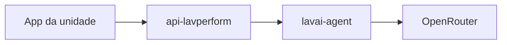

# Gerador de prompt do agente de IA

**Data:** 2026-09-24
**Status:** Aguardando revisão
**Contexto:** Unidades da Lav Perform não conseguem configurar o prompt do agente. O wizard pede para colar um system prompt em branco, as regras padrão são genéricas e o `contextPrompt` existe na API e no montador de prompt, mas a tela não pergunta. A IA responde errado e os clientes estão desconectando o atendimento.

## Objetivo

1. Gerar o primeiro prompt a partir de um questionário em linguagem da unidade.
2. Permitir refazer esse questionário a qualquer momento, para recriar o prompt de um agente que já responde mal.
3. Deixar o texto visível e editável na mão.
4. Testar perguntas no painel, com roteiro sugerido e campo livre, sem WhatsApp.
5. Quando uma resposta não ficar boa, propor a alteração exata e só gravar se a pessoa aceitar.
6. Depois que o agente existe, oferecer um chat especialista para o ajuste pontual.

## Decisões de produto

| Regra | Valor |
|-------|-------|
| Questionário | Na criação e de novo a qualquer momento num agente já salvo |
| Chat especialista | Só depois que o agente existe |
| Teste | Nos dois momentos: perguntas sugeridas e campo livre |
| Texto do prompt | Visível e editável na mão |
| Correção na criação | Proposta cai no rascunho. O chat não abre |
| Correção no agente salvo | Abre o chat com a pergunta, a resposta ruim e o que estava errado |
| Gravação | Só no aceite, ou quando a pessoa salva uma edição manual |
| Refazer questionário | Gera documento novo. O prompt salvo só muda no aceite |
| Base de conhecimento | Continua onde está. O questionário não substitui arquivos |
| Modelo | OpenRouter, modelo OpenAI já usado pelo agente. Sem segundo fornecedor |
| Rascunho da criação | Só na tela. Sair sem concluir descarta |

## Documento de prompt

Um documento com quatro partes, gravadas nos campos que o `PromptBuilderService` já injeta:

| Parte na tela | Campo | Conteúdo |
|---------------|-------|----------|
| Contexto do negócio | `contextPrompt` | Serviços, horários, prazos, preços e o que a unidade não informou |
| Foco do agente | `systemPrompt` | Para que ele existe no WhatsApp e quando chamar uma pessoa |
| Diretrizes | `behaviorGuidelines` | Como se comportar, o que confirmar e quando dizer que não sabe |
| Guardrails | `guardrails` | O que não pode fazer: inventar preço, prometer prazo, sair do assunto |

Tom de voz e estilo de comunicação continuam os seletores atuais (`voiceTone`, `communicationStyle`). Idioma permanece `PT_BR`.

Salvar grava cada parte no campo certo. O `contextPrompt` passa a aparecer na interface.

## Questionário

Perguntas em linguagem da unidade, não em linguagem de prompt.

| Pergunta | Obrigatória | Se ficar em branco |
|----------|-------------|--------------------|
| Serviços da unidade | Sim | Não gera |
| Foco do agente | Sim | Não gera |
| O que ele não pode prometer | Sim | Não gera |
| Horário e prazo | Não | O texto diz que a unidade não informou e que o agente não pode inventar |
| Como falar de preço | Não | Mesma regra de não inventar |
| Quando passar para um atendente | Não | Mesma regra de não inventar |

Sem as três obrigatórias, o modelo não é chamado.

## Fluxo

### Criação

1. Nome e descrição do agente, como hoje.
2. Questionário.
3. O modelo gera os quatro textos e de 4 a 6 perguntas sugeridas.
4. A pessoa lê, edita se quiser e testa. Nada vai para o WhatsApp.
5. Se uma resposta não ficou boa, ela descreve o erro. O modelo devolve a alteração exata. Ela aceita ou descarta. O chat não abre.
6. O agente só é salvo ao concluir.

### Agente já salvo

1. Refazer o questionário gera um documento novo. O prompt atual continua até o aceite. Antes de aceitar, ela pode ler, editar e testar o documento novo.
2. O teste também roda sobre o prompt salvo.
3. Resposta ruim abre o chat especialista já com a pergunta, a resposta e o que estava errado. A proposta só grava no aceite.
4. O chat também abre sem um teste falho, para ajuste fino.
5. A edição manual continua disponível.

Refazer o questionário recria o prompt inteiro. O chat só faz ajuste pontual.

## Arquitetura

Na criação, o questionário, o documento e o teste entram no wizard que hoje tem dados básicos, persona e mídia. No agente já salvo, ficam na área de persona: questionário para refazer, documento, teste e chat. As chamadas novas saem do `lavperform-app`, entram pela API que já faz proxy para o `lavai-agent`. O modelo roda no `OpenRouterLlmService`. Nenhuma das três operações grava sozinha.

### Gerar

Entrada: respostas do questionário, tom e estilo. Saída: os quatro textos e as perguntas sugeridas. Na criação, fica no rascunho da tela. Num agente salvo, só substitui a persona no aceite.

Modelo: o `modelName` do agente, quando ele já existe. Na criação, o mesmo padrão que o wizard já grava hoje, `openai/gpt-5`.

### Testar

Entrada: os quatro textos do documento em uso (rascunho ou salvo) e uma pergunta, sugerida ou livre. O `PromptBuilderService` monta as mensagens como no atendimento. Se o agente já existe e tem base de conhecimento, os trechos relevantes entram. Na criação ainda não há arquivos, então o teste usa só o rascunho.

A resposta volta para o painel. Não cria linha em `Conversation` e não envia WhatsApp.

### Propor alteração

Entrada: os quatro textos atuais, a pergunta, a resposta ruim e o que a pessoa escreveu. Saída:

- `summary`: o que vai mudar, em uma frase
- `changes`: só as partes alteradas, entre `contextPrompt`, `systemPrompt`, `behaviorGuidelines` e `guardrails`
- `baseUpdatedAt`: `updatedAt` da persona usada como base, ou ausente na criação

Proposta inválida é ignorada: formato fora desse contrato, texto substituto vazio, ou campo fora dos quatro. O documento não muda.

### Aceitar

- Criação: atualiza o rascunho na tela.
- Agente salvo: `PATCH` da persona só com as partes presentes em `changes`.
- Descartar: não grava.

Proposta velha não pode ser aceita. Ela está velha quando `baseUpdatedAt` não bate com o `updatedAt` atual da persona, ou quando o rascunho da criação mudou desde a proposta. A pessoa pede a alteração de novo sobre o texto atual. Edição manual salva, aceite de outro documento do questionário e aceite de outra proposta invalidam a proposta pendente.

Se o `PATCH` falhar, a tela volta ao texto do servidor e a proposta continua disponível para tentar de novo.

### Chat especialista

A terceira operação com histórico. Uma conversa por agente, separada de `Conversation` / `ConversationMessage`.

| Campo | Uso |
|-------|-----|
| `agentId` | Um fio por agente |
| mensagens | Papel da unidade ou do especialista, e o texto |
| proposta pendente | A última alteração ainda não aceita nem descartada |

Cada mensagem da unidade pode gerar uma proposta. Na criação não existe esse fio: a proposta cai direto no texto.

## Falhas

| Situação | Efeito |
|----------|--------|
| Questionário sem obrigatórias | Modelo não é chamado |
| Timeout, erro do modelo ou JSON inválido na geração ou no teste | Nada é salvo. A pessoa tenta de novo. Teste falho não abre o chat |
| Proposta inválida | Ignorada. Documento igual |
| Proposta velha | Aceite recusado. Pedir de novo |
| `PATCH` falha | Tela volta ao servidor. Proposta permanece |
| Descartar | Não grava |
| Sair da criação sem concluir | Rascunho descartado |

## Fora de escopo

Base de conhecimento, mídia, jornada, filtros, mensagem de boas-vindas, assinatura, e um segundo fornecedor de modelo.

## Testes

- Questionário completo devolve os quatro textos e de 4 a 6 perguntas sugeridas.
- Sem serviços, foco ou o que não pode prometer, o modelo não é chamado.
- Horário, preço ou passagem para atendente em branco viram instrução de não inventar no texto gerado.
- Teste usa o `PromptBuilderService`, não cria `Conversation` e não envia WhatsApp.
- Teste na criação usa só o rascunho. Teste de agente com base de conhecimento inclui os trechos.
- Proposta fora do formato não altera o documento.
- Proposta com `baseUpdatedAt` diferente do `updatedAt` atual é recusada.
- Descartar não chama o `PATCH`. Aceitar no agente salvo grava só as partes de `changes`. Aceitar na criação só muda o rascunho e não abre o chat.
- Refazer o questionário não substitui a persona até o aceite.
